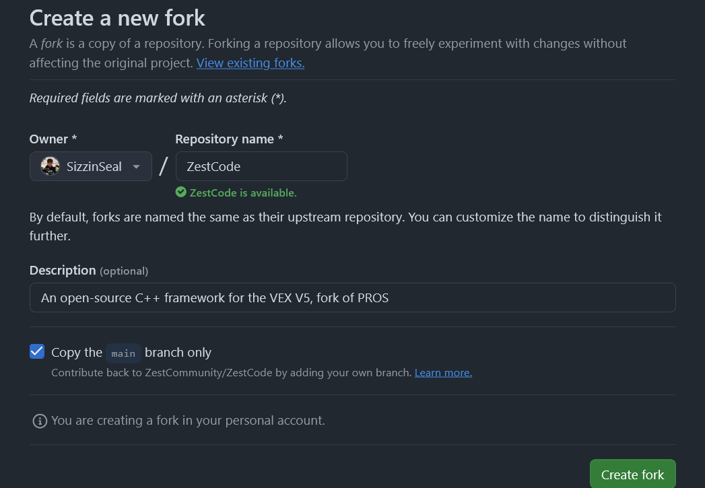

# Contributor's Guide

> [!TIP]
> Consider joining our [Discord Server](https://discord.gg/vNMXCvVwdY), it's the best place to discuss use/development of ZestCode.

First off, thanks for taking the time to contribute! ZestCode relies on people like **YOU** to stay bug-free and updated.

## Ways to contribute

### Bug Reports & Feature Requests

[Click Here](https://github.com/ZestCommunity/ZestCode/issues/new/choose) to submit a bug report, feature request, or privately report a security concern.

### Discussion

Discussion and decision making regarding the development of ZestCode happens mostly on the [ZestCode Discord Server](https://discord.gg/vNMXCvVwdY).
Just asking questions, proposing new ideas, and sharing your thoughts make a positive impact.

### Pull Requests

Pull Requests (short form: "PRs") are used to make changes to ZestCode. The rest of this guide is dedicated to submitting a PR.

## Your First PR: a step-by-step guide

### Step 1: Fork

> [!IMPORTANT]
> You'll need a GitHub account for this step

[Click Here](https://github.com/ZestCommunity/ZestCode/fork) to create your fork of ZestCode. Click on the green button on the bottom right.

